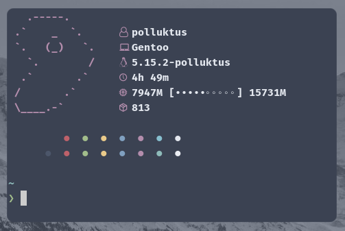

## <p align="center">`rsfetch`</p>

<p align="center"><i>extremely fast, simple and lightweight fetch program</i></p>
<br>



<p>Written in rust, fast and simple fetch program for UNIX based systems, configurable through <a href="src/config.rs">config.rs</a> at compile time. Made for learning purposes.</p><br>

<h3>Why use rsfetch?</h3>
<p">I created it to be as fast and low resource as possible, results can be seen in comparison part.</p><br>

## Requirements
*  `/etc/os-release`
*   <a href="https://www.rust-lang.org/learn/get-started">rust compiler</a>
*   <a href="https://www.nerdfonts.com/">Nerd Fonts</a>

<br>

## Comparison to others fetch programs

(AVG for 3 runs)

| Fetch program           | Maximum resident ram | Execution time | Minor page faults | Involuntary context switches |
| ---------------         | ------               | -------        | -----------       | ----------                   |
| **rsfetch**             | 2220kb               | 0s             |   186             |  2                           |
| neofetch                | 7103kb               | 0.12s          |   36095           |  24                          |
| fastfetch               | 10568kb              | 0s             |   740             |  12                          |
| afetch                  | 3868kb               | 0.02s          |   518             |  6                           |
| pfetch                  | 2304kb               | 0.01s          |   1339            |  6                           |
| screenfetch             | 48283kb              | 0.3s           |   37708           |  64                          |

<br>

## Supported distributions
* Gentoo
* Arch
* Artix
* Manjaro
* Ubuntu
* Debian
* Mint
* Fedora
* Void
* elementary OS
* Devuan
* Alpine Linux
* Rocky Linux

<br>

## Instalation
```
git clone https://github.com/polluktus/rsfetch.git
cd rsfetch
vim src/config.rs
sudo cargo install --path .
sudo strip /usr/local/bin/rsfetch
```
or more manual way
```
git clone https://github.com/polluktus/rsfetch.git
cd rsfetch
vim src/config.rs
cargo build --release
(optional but recommended) strip target/release/rsfetch
sudo cp -v target/release/rsfetch /usr/local/bin
```

<br>

## Thanks
* <a href="https://github.com/jschx/ufetch">ufetch</a> for ASCII arts
* <a href="https://github.com/13-CF/afetch">afetch</a> for inspiration to create this fetch.
